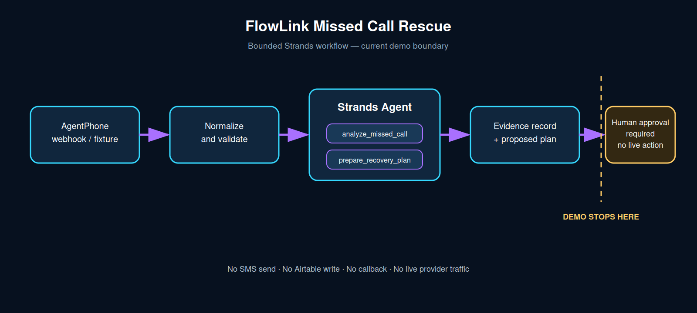

# FlowLink Missed Call Rescue

A bounded Strands Agents workflow that helps small service businesses turn a missed call into a reviewable recovery plan without silently contacting the customer.

## Demonstrated now

- A provider-neutral phone-event contract normalizes AgentPhone-style fixtures.
- Missed, no-answer, busy, and unanswered dispositions trigger `START_RESCUE`.
- A real `strands.Agent` registers and executes two custom tools in offline evidence mode.
- The resulting lead, SMS draft, and callback steps are `PROPOSED_ONLY` and require human approval.
- Tests prove that the demo performs no SMS send, Airtable write, phone call, or other external action.

## Not demonstrated

- Receipt of a live AgentPhone webhook.
- Live Bedrock model inference or AgentCore deployment.
- Airtable persistence, SMS delivery, or callback execution.
- Production webhook-signature compatibility with AgentPhone's current specification.

## Run the evidence path

Requires Python 3.10+ and Node.js 20+.

```bash
python -m venv .venv
source .venv/bin/activate
pip install -r requirements-dev.txt
python -m pytest -q
python -m rescue_agent.demo
```

The last command creates a Strands agent and exercises its registered tools without model inference or external side effects.

## Optional live-model path

After configuring AWS credentials and Bedrock model access:

```bash
python -m rescue_agent.demo --live-model
```

This path is optional and must not be claimed as verified until its output is captured successfully.

## Architecture



The demo boundary ends at a proposed recovery plan. See [the architecture notes](docs/architecture.md).

## Built with

- Strands Agents SDK for agent construction and tool registration
- Python for bounded decision and evidence orchestration
- Node.js for the existing AgentPhone event adapter and dry run
- GitHub Actions for repeatable evidence

## Security boundary

No secrets belong in this repository. `.env` is ignored. The demo contains placeholder phone numbers and deliberately omits live write/send adapters. Human approval is a declared product boundary, not a claim of production compliance.

## License

Apache-2.0. See [LICENSE](LICENSE).
