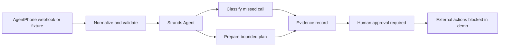

# Architecture

```mermaid
flowchart LR
  A[AgentPhone webhook or fixture] --> B[Normalize and validate]
  B --> C[Strands Agent]
  C --> D[Classify missed call]
  C --> E[Prepare bounded plan]
  D --> F[Evidence record]
  E --> F
  F --> G[Human approval required]
  G --> H[External actions blocked in demo]
```

The repository contains no live SMS, Airtable, or callback executor. The demo ends at a proposed plan.
