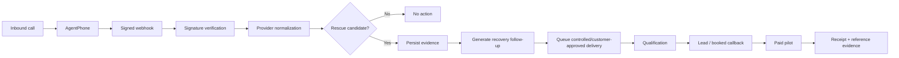

# Architecture and Evidence Chain

## Traceability

| Need | Satisfying component | Evidence |
|---|---|---|
| Detect a missed service call | AgentPhone adapter + provider normalizer | CI dry-run and test output |
| Reject unauthenticated webhook traffic | HMAC verification | Automated signature test |
| Avoid accidental sends during proof work | Dry-run harness | `externalSendPerformed: false` in evidence artifact |
| Preserve a defensible event trail | Production persistence boundary | Live webhook record, still required |
| Prove follow-up delivery | Messaging provider delivery result | Live delivery evidence, still required |
| Prove commercial value | Paid pilot | Payment/receipt + private customer reference, still required |

## Tensions and controls

**Speed vs. evidence quality:** shipping quickly is valuable, but code or dry-run output cannot be represented as customer revenue. Control: separate technical proof from commercial proof.

**Automation vs. consent/compliance:** immediate follow-up increases recovery speed, but outbound messaging must respect provider, carrier, consent, and applicable messaging requirements. Control: keep live delivery behind an explicit production configuration boundary.

**Provider specificity vs. portability:** AgentPhone is the first adapter, while the core event schema remains provider-neutral so a carrier can be replaced without rewriting the rescue decision model.

**Revenue urgency vs. capital risk:** the first commercial test should sell the deployment/pilot itself. It should not require borrowed funds or speculative spend to manufacture evidence.

## Definition of production proof

A production proof is complete only when a single correlation chain can connect:

`provider event ID -> call ID -> normalized rescue event -> follow-up delivery -> qualification -> paid pilot receipt`

Missing links remain explicit open gaps rather than inferred success.
